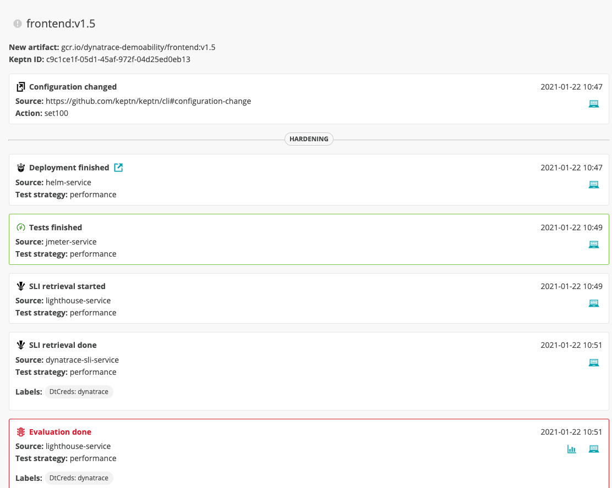
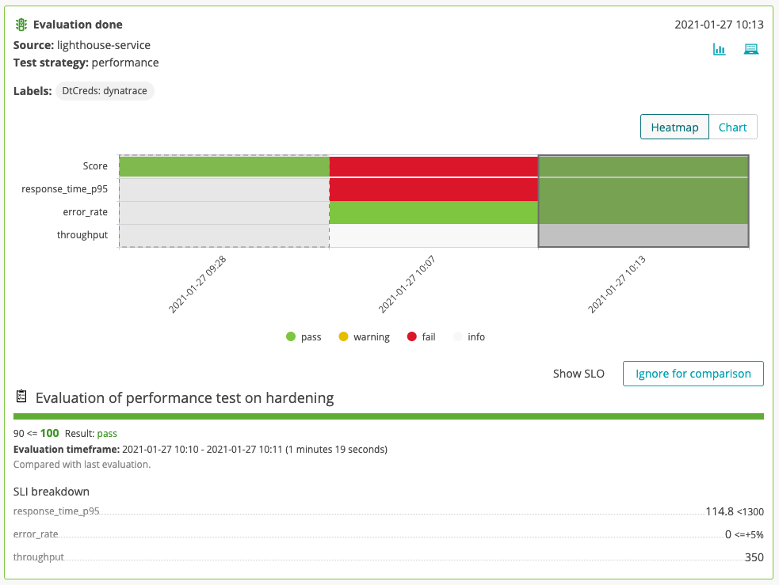

# Keptn Quality Gates

Quick recap: we have already deployed our application and configured our Dynatrace tenant for this application with the help of Keptn.
Let us now add [Keptn Quality Gates](https://keptn.sh/docs/0.7.x/quality_gates/) to the game that **will help us prevent us to ship bad code into production**! 
We already have added Dynatrace as the data source via the SLI service, now it is time to add some tests, have them executed automatically for each new version of a microservice and have the result evaluated by Keptn.

## Add Tests

First, we want to add some performance tests. Keptn comes with a built-in service for executing jmeter tests, but can be extended to use, e.g., NeoLoad or other test frameworks. 

# TO DO ^ TALK TRACK / SLIDE ON TESTS BEING ADDED

1. We are going to add the tests in terms of `.jmx` files added to the Keptn repository. These tests can be different for each service and stage. In this workshop, we are going to add some tests for our `frontend` service in the `hardening` stage.
    ```
    keptn add-resource --project=hipstershop --stage=hardening --service=frontend --resource=/home/$(whoami)/keptn-hotday-2021/service/frontend/jmeter/load.jmx --resourceUri=jmeter/load.jmx

    keptn add-resource --project=hipstershop --stage=hardening --service=frontend --resource=/home/$(whoami)/keptn-hotday-2021/service/frontend/jmeter/jmeter.conf.yaml --resourceUri=jmeter/jmeter.conf.yaml
    ```

1. Now comes the part where we are going to **add the Keptn quality gate**! As already dicussed, Keptn is incorporating SRE best practices and therefore quality gates are built on Service-Level Objectives (SLOs). 

    ```
    keptn add-resource --project=hipstershop --stage=hardening --service=frontend --resource=/home/$(whoami)/keptn-hotday-2021/service/frontend/slo.yaml --resourceUri=slo.yaml
    ```

    Let's take a look at the content of this `slo.yaml` file.

    ```
    ---
    spec_version: "0.1.1"
    comparison:
      aggregate_function: "avg"
      compare_with: "single_result"
      include_result_with_score: "pass"
      number_of_comparison_results: 1
    filter:
    objectives:
      - sli: "response_time_p95"
        key_sli: false
        pass:             # pass if (relative change <= 10% AND absolute value is < 1300ms)
          - criteria:
              - "<1300"    
              - ">=+10%"   
        warning:          
          - criteria:
              - "<=1500"
        weight: 1
      - sli: error_rate
        pass:
          - criteria:
              - "<=+5%"  # not allowed to increase by more than 5% to previous evaluation
      - sli: throughput
    total_score:
      pass: "90%"
      warning: "75%"
    ```

1. Now that we have added some tests and the quality gate definition, let us deploy a new version of our `frontend` service and test the quality gate. 
    ```
    keptn send event new-artifact --project=hipstershop --service=frontend --image=gcr.io/dynatrace-demoability/frontend --tag=v1.5
    ```
    <!--
      initial version:
      ```
      keptn send event new-artifact --project=hipstershop --service=frontend --image=gcr.io/dynatrace-demoability/frontend --tag=v1.0
      ```
    -->

1. Next, we are going to take a look at the quality gate evaluation in the Keptn's Bridge, which allows us to take a look at what is going on in Keptn. If you don't have it still open, please get the URL via this command and open the link on your browser.
    ```
    echo http://$(kubectl get ing -n keptn api-keptn-ingress -o=jsonpath='{.spec.tls[0].hosts[0]}')
    ```

    It will give you a link like http://keptn.xx-xxx-xxx-xxx.nip.io/.
    Open the bridge and find the `frontend` service in the `hipstershop` project.

    

1. You can see that the evaluation failed since the `response_time_p95` did not meet the specified SLO. Thanks to the Keptn quality gate, this version is not promoted to production, but actually rolled back to the previous (stable) version.

1. Luckily, we do have another version of our `frontend` microservice at hand that we can deploy. Let's give this new version a try!

    ```
    keptn send event new-artifact --project=hipstershop --service=frontend --image=gcr.io/dynatrace-demoability/frontend --tag=v2.1
    ```

1. Switch to the Keptn's Bridge and have a look if this version is passing the quality gate and if it is shipped all the way to production with Keptn!

    


### Great job! Let's now continue to the next part of the lab!
