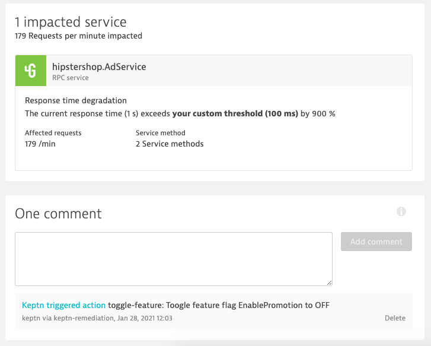
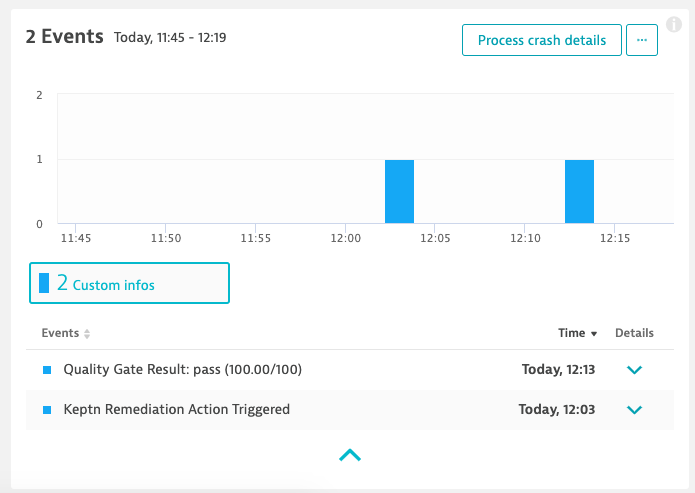

# Automating Operations & Remediation

In this part of the workshop we are moving from *deploying* our applications to production to *operating* them in production and keep them healthy! This is the part that you might already be familiar with Dynatrace and its great A.I. assistant Davis that discovers production issues and its root cause automatically. In the next part, we are taking this even further with Keptn, which can automatically react on those identified problems and trigger counter-actions that will remediate the issue. Even more: Keptn will make sure that the issue is actually remediated, and if not, more remediation actions can be triggered. Exciting, right?

Let's get started!

## Feature flags

Our application is prepared with a feature flag that we can turn on and off without the need to redeploy the application. We are going to use [Unleash](https://unleash.github.io/) as the framework for the feature flags.

### Configure Unleash

Unleash has already been deployed via the setup of the workshop. Our task is to configure the feature flags that we are going to use.

Set some variables:
```
export UNLEASH_TOKEN=$(echo -n keptn:keptn | base64)
export UNLEASH_BASE_URL=http://unleash.unleash-dev.$(kubectl get ing -n default homepage-ingress -o=jsonpath='{.spec.tls[0].hosts[0]}')
```

Execute the API call to Unleash.
```
curl --request POST \
  --url ${UNLEASH_BASE_URL}/api/admin/features/ \
  --header "authorization: Basic ${UNLEASH_TOKEN}" \
  --header 'content-type: application/json' \
  --data '{
  "name": "PromotionCampaign",
  "description": "adservice",
  "enabled": false,
    "strategies": [
    {
      "name": "default",
      "parameters": {}
    }
  ]
}'
```

Let's verify that the feature flag was created in your Unleash server.

```
echo http://unleash.unleash-dev.$(kubectl get ing -n default homepage-ingress -o=jsonpath='{.spec.tls[0].hosts[0]}')
```
Credentials: keptn/keptn

We can see one feature flag created.


## Configure Keptn for Unleash


1. We are going to add some remediation instructions to Keptns by means of adding a `remediation.yaml` file. This file contains a sequence of actions that will be triggered in response to a problem ticket received from Dynatrace. With this, you can build your own remediation workflows!

    ```
    keptn add-resource --project=hipstershop --service=adservice --stage=production --resource=/home/$(whoami)/keptn-hotday-2021/service/adservice/remediation.yaml --resourceUri=remediation.yaml
    ```

The instructions that we are adding have the following content:

```
apiVersion: spec.keptn.sh/0.1.4
kind: Remediation
metadata:
  name: adservice-remediation
spec:
  remediations:
    - problemType: Response time degradation
      actionsOnOpen:
        - action: toggle-feature
          name: Toogle feature flag
          description: Toogle feature flag PromotionCampaign to OFF
          value: 
            PromotionCampaign: "off"
    - problemType: Failure rate increase
      actionsOnOpen:
        - action: toggle-feature
          name: Toogle feature flag
          description: Toogle feature flag PromotionCampaign to OFF
          value: 
            PromotionCampaign: "off"
```

2. Next we are going to add an SLO file for our `AdService`. This file checks if our SLOs are met. You will remember this from our quality gates earlier, although for a different service. This time we are going to use the SLO file for checking if the remediation is actually working! No guesswork anymore, we will have proof by an automated execution of Keptn quality gates after each remediation action.

    ```
    keptn add-resource --project=hipstershop --service=adservice --stage=production --resource=/home/$(whoami)/keptn-hotday-2021/service/adservice/slo.yaml --resourceUri=slo.yaml
    ```

## Let's run the experiment

Let's now change our configuration without redeploying the application. We will do this via the feature flag that we just created in Unleash. 
Please note that our application is already prepared to implement the effect of the feature flag and with Unleash we have a nice way to toggle the feature flag from outside of the application.

In your Unleash environment, let's do the following: **Turn on** the feature flag "PromotionCampaign" that we created earlier.


### What will happen next?

This will enable a special promotion in our `AdService` of the Hipstershop. However, in our demo it is expected, that this will introduce some troubles. But don't worry, Keptn got us covered!

After a couple of minutes Dynatrace will detect a decrease in the response time of the `AdService` and will open a problem ticket. Due to the Keptn integration with Dynatrace, an alert is sent from Dynatrace to Keptn.
Keptn will pick up this problem event (alert) and start executing the remediation workflow. 

The workflow was already defined by us in the `remediation.yaml` file that we added earlier. Again, a short recap what we have defined:

```yaml
apiVersion: spec.keptn.sh/0.1.4
kind: Remediation
metadata:
  name: adservice-remediation
spec:
  remediations:
    - problemType: Response time degradation
      actionsOnOpen:
        - action: toggle-feature
          name: Toogle feature flag
          description: Toogle feature flag PromotionCampaign to OFF
          value: 
            PromotionCampaign: "off"
    - problemType: Failure rate increase
      actionsOnOpen:
        - action: toggle-feature
          name: Toogle feature flag
          description: Toogle feature flag PromotionCampaign to OFF
          value: 
            PromotionCampaign: "off"
```

In this example, we have two remediations defined, but in today's workshop we only use the one for the `problemType` "Response time degradation". There is an `action` defined if the problem opens, which is a `toggle-feature` action. It has name, description, and what is important for the automation part: a value property with key/value pairs. In our case the key is the name of the feature flag, i.e., `PromotionCampaign` and the value is the state we want the feature toggle to set. 

The [Unleash feature toggle integration](https://github.com/keptn-contrib/unleash-service/) is picking up these values and executing the remediation as defined in the declarative `remediation.yaml` file. 

We will see all the steps that are executed in the Keptn's Bridge:


We see that Keptn triggered the remediation by means of switching off the feature flag. We can also see that Keptn triggered another evaluation, reusing again the SLOs that we have already defined. 
If the SLOs are met again, the remediation loop is closed, if not, Keptn will trigger the next remediation (if defined).

### Investigate problem ticket
Let's have a look at the problem ticket in Dynatrace by clicking on the **Problem URL** label in the Keptn's Bridge.



On the `AdService` itself you will also see that Keptn triggered a remediation action and that the quality gate was successfully executed.



# Congratulations!

Congratulations! 
You have successfully completed the hands-on-training and you are now ready for your Autonomous Cloud Journey with [Keptn](https://keptn.sh)!

To explore more use cases around Keptn, there is a dedicated tutorials hub that will help you get started: [tutorials.keptn.sh](https://tutorials.keptn.sh).
And if you want to get in touch with the Keptn community, please consider joining our [Slack channel](https://slack.keptn.sh) and follow us on Twitter via [@keptnProject](https://twitter.com/keptnProject)!

## Summary
What you have accomplished in this hands-on-training:

- Set up a multi-stage delivery pipeline with Keptn
- Deployed full hipstershop in two stages: hardening and production
- Automatically configered Dynatrace with default dashboards, tagging rules, management zones, alerting, etc
- Set up a quality gate for one microservice using data from Dynatrace
- Added auto-remediation instructions to remediate issues in production

# Resources

If you want to learn more, please have a look at the following resources.

- Keptn website [keptn.sh](https://keptn.sh)
- Keptn tutorials [tutorials.keptn.sh](https://tutorials.keptn.sh)
- Star us on Github [github.com/keptn/keptn](https://github.com/keptn/keptn)
- Join the conversation on [Slack](https://slack.keptn.sh)
- Follow us on Twitter [@keptnProject](https://twitter.com/keptnProject)

