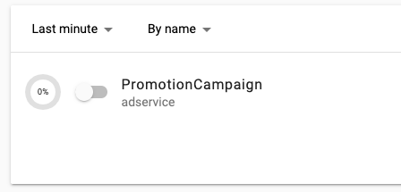
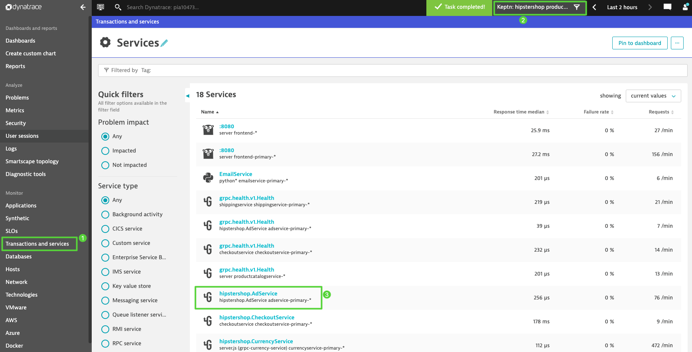
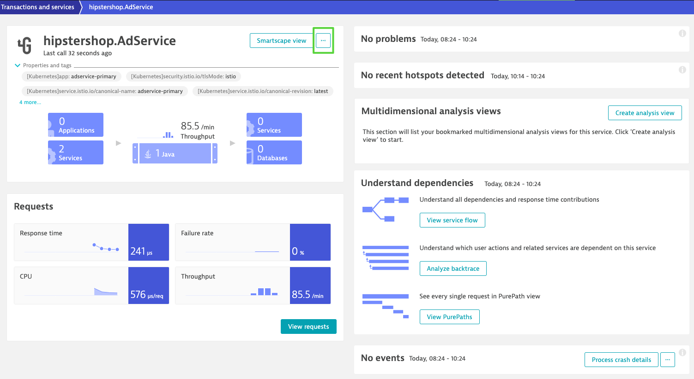
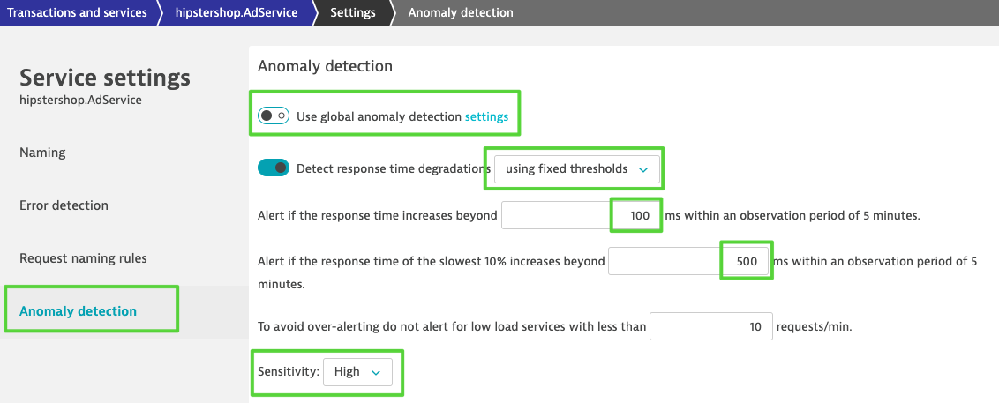
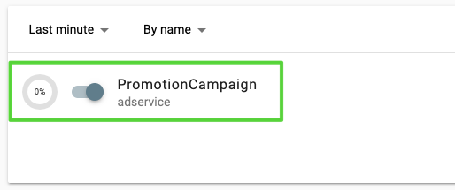
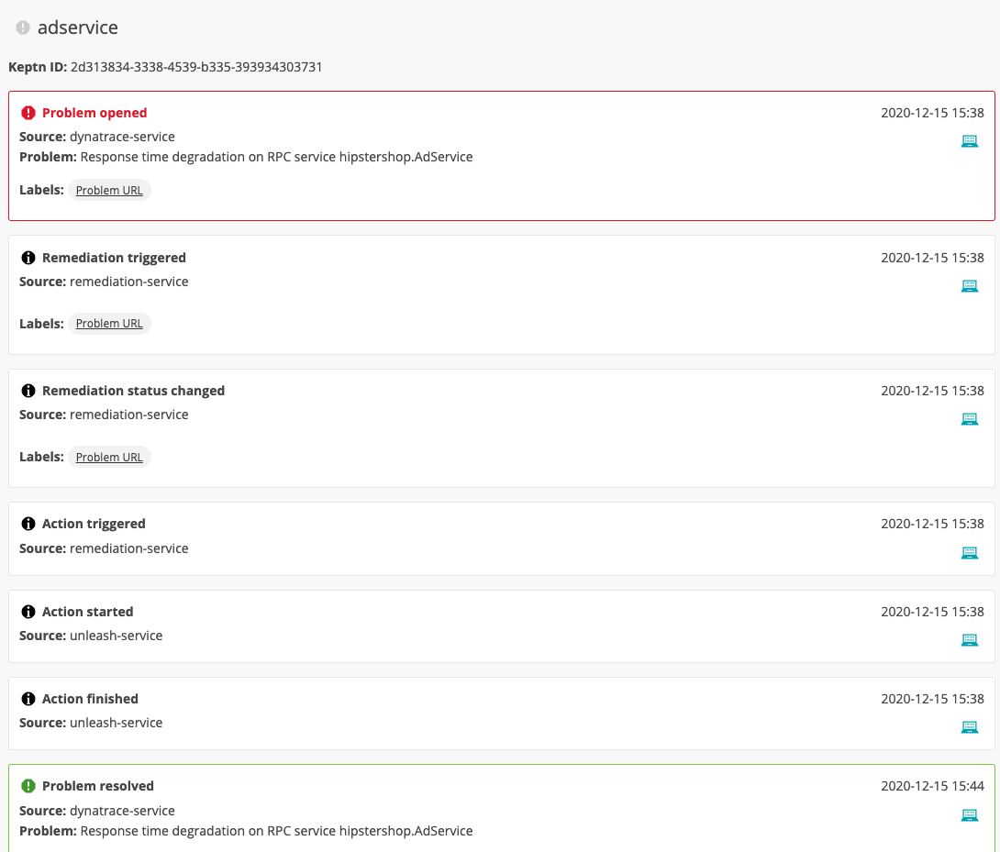

# Automating Operations & Remediation

In this part of the workshop we are moving from *deploying* our applications to production to *operating* them in production and keep them healthy! This is the part that you might already be familiar with Dynatrace and its great A.I. assistant Davis that discovers production issues and its root cause automatically. In the next part, we are taking this even further with Keptn, which can automatically react on those identified problems and trigger counter-actions that will remediate the issue. Even more: Keptn will make sure that the issue is actually remediated, and if not, more remediation actions can be triggered. Exciting, right?

Let's get started!

## Feature flags

Our application is prepared with a feature flag that we can turn on and off without the need to redeploy the application. We are going to use [Unleash](https://unleash.github.io/) as the framework for the feature flags.

### Configure Unleash

Unleash has already been deployed via the setup of the workshop. Our task is to configure the feature flags that we are going to use.

Set some variables:
```
export UNLEASH_TOKEN=$(echo -n keptn:keptn | base64)
export UNLEASH_BASE_URL=http://unleash.unleash-dev.$(kubectl get ing -n default homepage-ingress -o=jsonpath='{.spec.tls[0].hosts[0]}')
```

Execute the API call to Unleash.
```
curl --request POST \
  --url ${UNLEASH_BASE_URL}/api/admin/features/ \
  --header "authorization: Basic ${UNLEASH_TOKEN}" \
  --header 'content-type: application/json' \
  --data '{
  "name": "EnablePromotion",
  "description": "adservice",
  "enabled": false,
    "strategies": [
    {
      "name": "default",
      "parameters": {}
    }
  ]
}'
```

Let's verify that the feature flag was created in your Unleash server.

```
echo https://unleash.unleash-dev.$(kubectl get ing -n default homepage-ingress -o=jsonpath='{.spec.tls[0].hosts[0]}')
```
Credentials: keptn/keptn

We can see one feature flag created


## Configure Keptn for Unleash

### Credentials
The credentials for Unleash have already been added in the inital installation script.

TODO probably remove this:
```
kubectl apply -f https://raw.githubusercontent.com/keptn-contrib/unleash-service/release-0.2.0/deploy/service.yaml -n keptn
```

## Keep this for reference (might not be needed - we have to verify it)

1. Configure unleash remediation instructions

```
keptn add-resource --project=hipstershop --service=adservice --stage=production --resource=/home/$(whoami)/keptn-hotday-2021/service/adservice/remediation.yaml --resourceUri=remediation.yaml
```

The instructions that we are adding:

```
apiVersion: spec.keptn.sh/0.1.4
kind: Remediation
metadata:
  name: adservice-remediation
spec:
  remediations:
    - problemType: Response time degradation
      actionsOnOpen:
        - action: toggle-feature
          name: Toogle feature flag
          description: Toogle feature flag EnablePromotion to OFF
          value: 
            EnablePromotion: "off"
    - problemType: Failure rate increase
      actionsOnOpen:
        - action: toggle-feature
          name: Toogle feature flag
          description: Toogle feature flag EnablePromotion to OFF
          value: 
            EnablePromotion: "off"
```

2. Next we are going to add an SLO file for our `AdService`.
```
keptn add-resource --project=hipstershop --service=adservice --stage=production --resource=/home/$(whoami)/keptn-hotday-2021/service/adservice/slo.yaml --resourceUri=slo.yaml
```

3. Login to the Dynatrace Tenant UI
Navigate to the hipstershop adservice in your Dynatrace tenant:


Next, we are going to edit the anomaly detection to overwrite the Davis AI default settings.

- click on the "..." in the header of the service and then "Edit"
- click on "Anomaly detection"

4. Modify the service settings as outlined below
- **Disable** global anomaly detection
- Set "detect response time degradations" to "**using fixed thresholds**" from the drop down
- Set "Alert if the response time increases beyond **100**ms within an observation period of 5 minutes.
- Set "Alert if the response time of the slowest 10% increases beyond" to **500**ms
- Set sensitivity to "High"
- In the "Reference Period" section at the end, click **Reset** the reference period
- See image below for reference



5. Deploy version that has the flag included. 

also the JDK11 version should have the feature flag included -- TO BE TESTED!
```
keptn send event new-artifact --project=hipstershop --service=adservice --image=gcr.io/dynatrace-demoability/adservice --tag=v1.5
```


## Let's run the experiment

Let's now change our configuration without redeploying the application. We will do this via the Feature Toggle that we just created. 
Please note that our application is already prepared to implement the effect of the feature flag and with Unleash we have a nice way to toggle the feature flag from outside of the application.

In your Unleash environment, let's do the following: **Turn on** the feature flag "EnablePromotion" that we created earlier.


### What will happen next?

This will enable a special promotion in our `AdService` of the Hipstershop. However, it our demo it is expected, that this will introduce some troubles. But don't worry, Keptn got us covered!

After a couple of minutes Dynatrace will detect a decrease in the response time of the `AdService` and will open a problem ticket. Due to the Keptn integration with Dynatrace, an alert is sent from Dynatrace to Keptn.
Keptn will pick up this problem event (alert) and start executing the remediation workflow. 

The workflow was already defined by us in the `remediation.yaml` file that we added earlier. Again, a short recap what we have defined:

```yaml
apiVersion: spec.keptn.sh/0.1.4
kind: Remediation
metadata:
  name: adservice-remediation
spec:
  remediations:
    - problemType: Response time degradation
      actionsOnOpen:
        - action: toggle-feature
          name: Toogle feature flag
          description: Toogle feature flag EnablePromotion to OFF
          value: 
            EnablePromotion: "off"
    - problemType: Failure rate increase
      actionsOnOpen:
        - action: toggle-feature
          name: Toogle feature flag
          description: Toogle feature flag EnablePromotion to OFF
          value: 
            EnablePromotion: "off"
```

In this example, we have two remediations defined, but in today's workshop we only use the one for the `problemType` "Response time degradation". There is an `action` defined if the problem opens, which is a `toggle-feature` action. It has name, description, and what is important for the automation part: a value property with key/value pairs. In our case the key is the name of the feature flag, i.e., `EnablePromotion` and the value is the state we want the feature toggle to set. 

The [Unleash feature toggle integration](https://github.com/keptn-contrib/unleash-service/) is picking up these values and executing the remediation as defined in the declarative `remediation.yaml` file. 

We will see all the steps that are executed in the Keptn's Bridge:


We see that Keptn triggered the remediation by means of switching off the feature flag. We can also see that Keptn triggered another evaluation, reusing again the SLOs that we have already defined. 
If the SLOs are met again, the remediation loop is closed, if not, Keptn will trigger the next remediation (if defined).

# Congratulations!

Congratulations! 
You have successfully completed the hands-on-training with Dynatrace and Keptn!

## Summary
What you have accomplished in this hands-on-training:

- tba
- tba
- tba

# Resources

If you want to learn more, please have a look at the following resources.

- Keptn website [keptn.sh](https://keptn.sh)
- Keptn tutorials [tutorials.keptn.sh](https://tutorials.keptn.sh)
- Star us on Github [github.com/keptn/keptn](https://github.com/keptn/keptn)
- Join the conversation on [Slack](https://slack.keptn.sh)
- Follow us on Twitter [@keptnProject](https://twitter.com/keptnProject)

