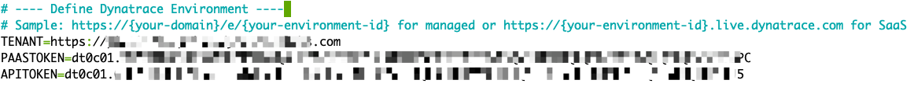
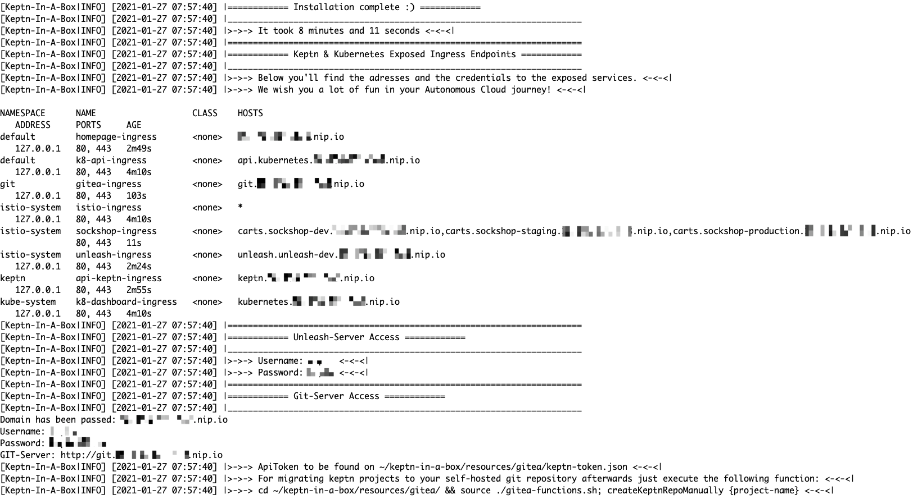

# Autonomous Cloud with Keptn: Delivery & Operations 


## Welcome to the Hands-on-Training day

In the next sections you will find the instructions to get familiar with the concept of the "Autonomous cloud" using Dynatrace and the open-source control-plane Keptn to implement it. 
We have prepared detailed instructions that should help you to successfully complete the hands-on-training. However, please reach out to the instructors immediately if you get stuck or run into any issues.

And most importantly: let's have fun walking through the lab!
## Infrastructure in AWS

We have prepared the infrastructure for you. This is what's running behind the scenes to provide you this lab:
- Ubuntu 20.4 LTS in AWS
- Instance size: m5.4xlarge
- Disk size: 30GB
- MicroK8s

## Connect to your instance

To get started, we will SSH into the machine that is provided for you. There is no need to install anything locally on your own machine. We will execute all of the commands from the provided instance.

Now please go ahead and follow your instructor to login to your machine.
## Install Keptn

While we are going to learn what Keptn is, we will trigger the installation in the background. Please note that this script is provided for workshop scenarios and will install more than just Keptn.
In fact, we are going to install MicroK8s, Dynatrace OneAgent, Keptn, and even have it initially configured so we can already access it. 

There is a script provided for you, please go ahead and download the installation script.

### 1. Download the github repo to your home directory
```
curl -O https://raw.githubusercontent.com/keptn-sandbox/keptn-in-a-box/release-0.7.3/keptn-in-a-box.sh
```
### 2. Open the file to edit it
We have to paste in some credentials into the file, therefore we are going to open it.

```
nano keptn-in-a-box.sh
```

Move down to the section **Define Dynatrace Environment** in line 39.
```
# ---- Define Dynatrace Environment ----
# Sample: https://{your-domain}/e/{your-environment-id} for managed or https://{your-environment-id}.live.dynatrace.com for SaaS
TENANT=
PAASTOKEN=
APITOKEN=
```

Now the next steps are **very important**.
Copy and paste your Dynatrace tenant into the file. Please mind the format: **include https://** but **no trailing slashes** allowed!

A correct value is `TENANT=https://pia11111.sprint.dynatracelabs.com`

Next, we are going to fetch the tokens.


### 3. Create a Dynatrace PaaS Token
In your Dynatrace tenant, go to **Settings > Integration > Platform as a Service**, and create a new PaaS Token.


### 4. Create a Dynatrace API Token
Log in to your Dynatrace tenant and on the left-hand side go to **Settings > Integration > Dynatrace API**. 
Then, create a new API token with the following permissions:

* Access problem and event feed, metrics, and topology
* Read log content
* Read configuration
* Write configuration
* Capture request data
* Real user monitoring JavaScript tag management
* Read metrics
* Ingest metrics
* Read entities

The below screen shot can be used for reference:


### 5. Execute the installer for Keptn-in-a-box

**Important**: Before you proceed, please double check the provided values.
- No trailing slashes for TENANT but with the https:// prefix
- PAASTOKEN set to the PaaS token
- APITOKEN set to the API token



Save the file (`CTRL+O, CTRL+X`) and proceed.

### 6. Execute the installer script which will take a couple of minutes to finish.
```
chmod +x keptn-in-a-box.sh; sudo bash -c './keptn-in-a-box.sh &'
```
### 7. Ignore the LESS command output and use the below command to watch the logs

While we wait for it to finish, we can watch the log output.
```
tail -f /tmp/install.log
```

You can exit this with `CTRL+c`.

Installation will take about 10 minutes, please be patient.
In the meanwhile, your instructor will tell you more about Keptn and this hands-on-training.

The last lines of the install log will look similar to this.



## What has been installed?

- Docker
- MicroK8s: a small Kubernetes distribution
- Keptn (control-plane + execuption-plane)
- Unleash feature toggle framework
- Dynatrace OneAgent
- Sockshop (carts micro service) with multi-stage pipeline
- Gitea - our UI for Git (check the installation logs)
- A simple welcome website (check the installation logs)

## Clone needed resources

You will need a couple of resources in this workshop. Let's go ahead and get them!

### 8. Run the following command to restart some of the deployed pods

Dynatrace OneAgent auto-injects at run time when pods come up in Kubernetes. This will ensure any pods which may have been started before OneAgent could be fully installed will be properly instrumented. 

```
for i in keptn ingress default unleash-dev ; do kubectl delete pods --all -n $i; done
```
### 9. Clone needed resources into your home directory

Let's clone some needed resources that will come in handy for our workshop.

```
git clone https://github.com/keptn-hotday-2021/keptn-hotday-2021
```

## Troubleshooting

If the installation fails and you want to start over again, please remove microk8s first.
```
sudo snap remove microk8s
```