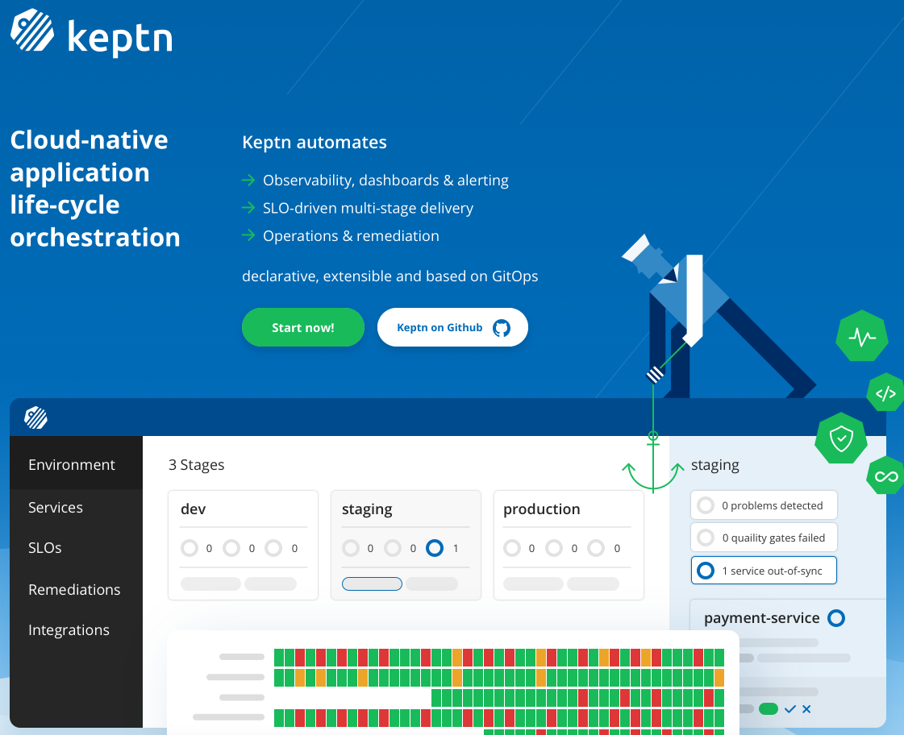

## Keptn 


### What is Keptn?

Keptn is an cloud-native application life-cylce orechstration tool that helps you building and managing your autonomous cloud. 
In the workshop, we are going to use Keptn for deploying, managing, and operating our applications. In the following you'll find some commands that might be handy.

#### Basic Keptn commands
- Check the version of the Keptn CLI as well as the Keptn cluster (if authenticated)

  ```
  keptn version
  ```

- Check the status of your Keptn CLI

  ```
  keptn status
  ```

- Check what you can do with the Keptn CLI

  ```
  keptn --help
  ```

To learn more about Keptn check out the below links:

- [Keptn Website](https://keptn.sh/)
- [Join The Keptn Slack Channel](https://slack.keptn.sh/)
- [Join The Keptn Community and Contribute to the Keptn Project](https://github.com/keptn/community)
