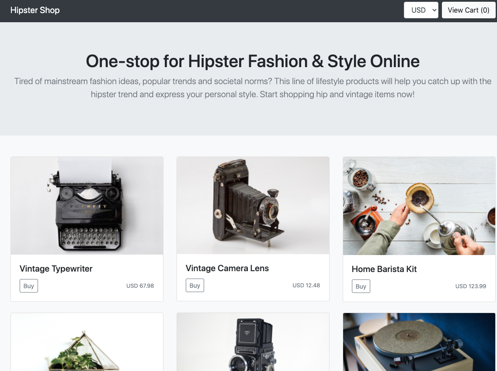
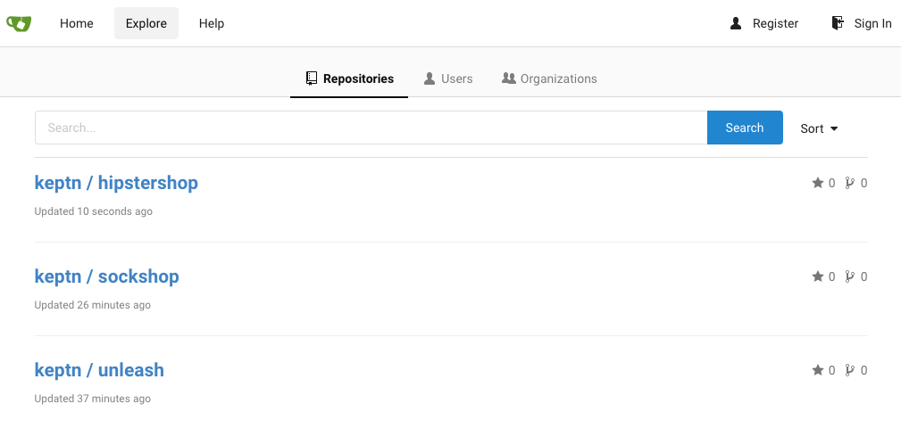
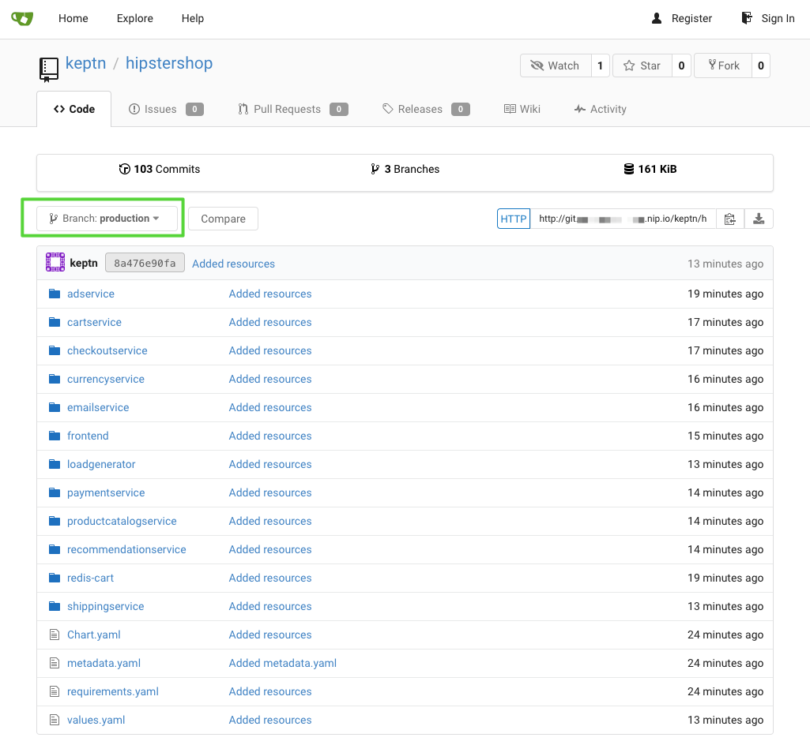

## Deploy Hipstershop

In the first part of the workshop we will deploy a polyglot microservice application consisting of a couple of different microservices. Therefore, we will use the **Hipstershop/Online Boutique** application, which is a common demo application initially developed by Google.

We are going to use Keptn to set up a multi-stage delivery pipeline with quality gates to control the release of new versions into production. In the second part of the workshop we will be extending this to bring auto-remediation into the project as well.

### Create project 

As a first step, we are going to create a Keptn project that will hold all our resources like deployment files, and Keptn configurations for different stages, and microservices.

```
keptn create project hipstershop --shipyard=/home/$(whoami)/keptn-hotday-2021/keptn-resources/shipyard.yaml
```

The file that we are going to use here has the following content:
```
stages:
  - name: "hardening"
    test_strategy: "performance"
    deployment_strategy: "blue_green_service"
  - name: "production"
    approval_strategy:
      pass: "automatic"
      warning: "manual"
    deployment_strategy: "blue_green_service"
    remediation_strategy: "automated"
```

As you can see, the shipyard file defines two stages for our multi-stage delivery in Keptn. The first stage is called "hardening" and we will deploy with a "blue_green" deployment strategy and our test strategy in this stage is to execute "performance" tests. 
For our "production" stage, we define how we want to execute the approval process. If the Keptn quality gates "passes" we want to automatically deploy the approved microservice into production. If the quality gate evaluation results in a warning, we want a "manual" approval process. Deployment should be again done using a "blue/green" deployment strategy. On top of this, we define to automatically execute remediation actions as counter measures if Keptn receives problem alerts from Dynatrace.

### Onboard services

Now that we have a project, let us add our application in terms of onboarding each microservice that we want to manage with Keptn.

1. Let's add our first service, which is the `AdService`. This command will add the Helm deployment files to Keptn and create needed resources such as Istio configuration files that you don't have to manage.
```
keptn onboard service adservice --project=hipstershop --chart=/home/$(whoami)/keptn-hotday-2021/helm/adservice/
```


2. Now that we added deployment information in terms of Helm charts to Keptn, we can go ahead and deploy a specific version of our first microservice.
```
keptn send event new-artifact --project=hipstershop --service=adservice --image=docker.io/jetzlstorfer/adservice:promotioncampaign-slow
```

3. Let's add our second service in the same way we did with the first one:
```
keptn onboard service redis-cart --project=hipstershop --chart=/home/$(whoami)/keptn-hotday-2021/helm/redis-cart/ --deployment-strategy=direct
```

Maybe you have spotted already the difference in the `deployment-strategy`? Well, for our redis deployment we don't want to have a blue/green deployment which would be the default for all of the services as defined in the `shipyard.yaml` file. 

4. Again, we want to deploy it. This service will be deployed *directly*, no blue/green deployment strategy in contrast to the previous service.
```
keptn send event new-artifact --project=hipstershop --service=redis-cart --image=redis:alpine
```

5. The remaining services can be onboarded with the script from the github repo 
```
/home/$(whoami)/keptn-hotday-2021/scripts/onboard-hipstershop.sh
```

6. Once the script has finished running verify that you can reach both URLs which were printed in the console. 



Please let your instructor know if you can not access the application.

7. As Keptn is Git-based, we also want to have insights into the Git repo of Keptn. Usually, this would be connected to Bitbucket, Github, GitLab, etc - but for today we are using Gitea, which is a simple UI for exploring our Git repo. We have to update our Keptn project, and we'll go ahead and do this via a helper function that will provide us the necessary token.

```
cd /home/$(whoami)/keptn-in-a-box/resources/gitea
source ./gitea-functions.sh ; createKeptnRepoManually hipstershop

cd /home/$(whoami)
```

You can access your gitea instance:
```
echo http://$(kubectl get ing -n git gitea-ingress -o=jsonpath='{.spec.tls[0].hosts[0]}')
```

Take a look in Gitea and verify that the Git upstream has been successfully created.




8. Dynatrace OneAgent auto-injects at run time when pods come up in Kubernetes. To ensure that all pods have been properly injected we will issue the below command to redeploy all pods. This will ensure any pods which may have been started before OneAgent could be fully installed will be properly instrumented. 

```
for i in $(kubectl get namespaces | awk '{print $1}' | grep -v "NAME\|dynatrace\|kube") ; do kubectl delete pods --all -n $i; done
```

### Troubleshooting 

If you are unable to reach the URLS or some pods are not running run the below command to identify the pods and notify your instructor. 
```
kubectl get pod --all-namespaces | grep -v "Running\|Terminating\|NAME"
```
Once the pods are succesfully running try the two URLs again. You can re-generate the urls with the below two commands. (execute and open the URLs in a browser)
```
echo http://frontend.hipstershop-hardening.$(kubectl get ing -n default homepage-ingress -o=jsonpath='{.spec.tls[0].hosts[0]}')

echo http://frontend.hipstershop-production.$(kubectl get ing -n default homepage-ingress -o=jsonpath='{.spec.tls[0].hosts[0]}')
```
If updating the project with Git upstream to Gitea is not working:
- delete the GIT token in user/settings/applications in Gitea online with `deleteApiToken` and then execute the `source ./gitea-functions.sh ; createKeptnRepoManually hipstershop` again.
- if not working, delete the `keptn-token.json`

