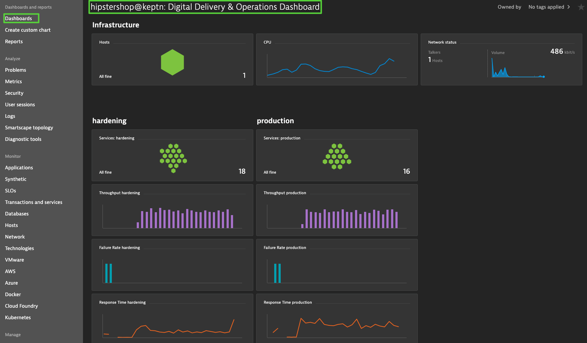
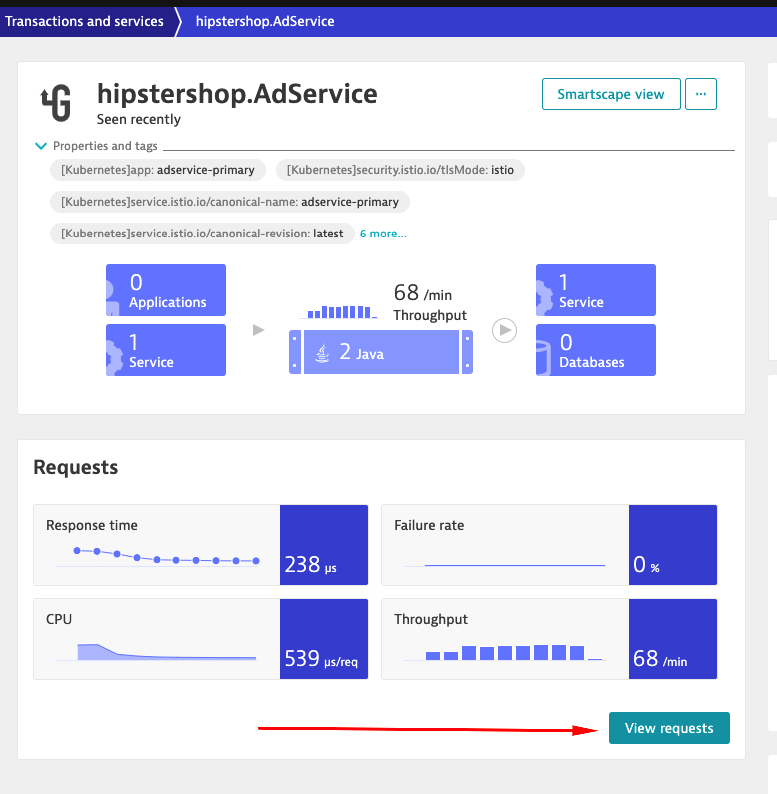
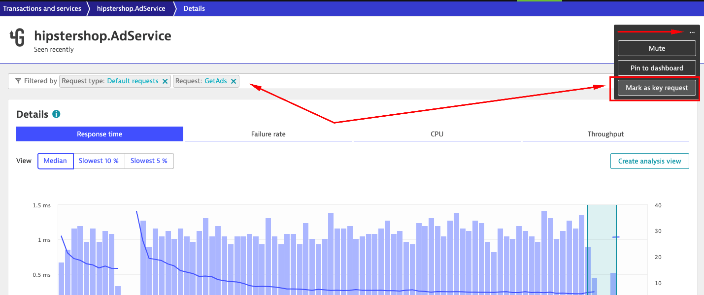
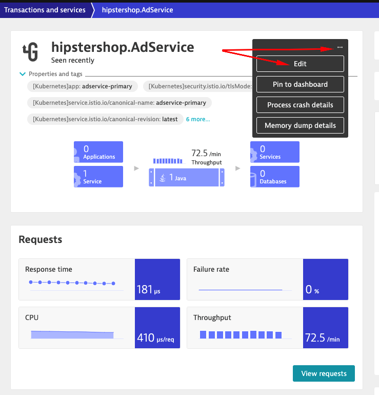
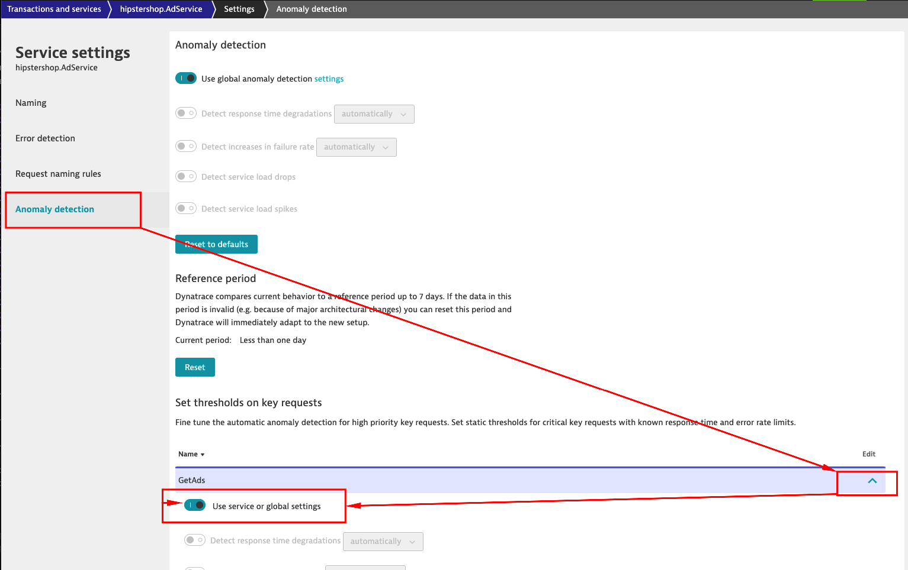
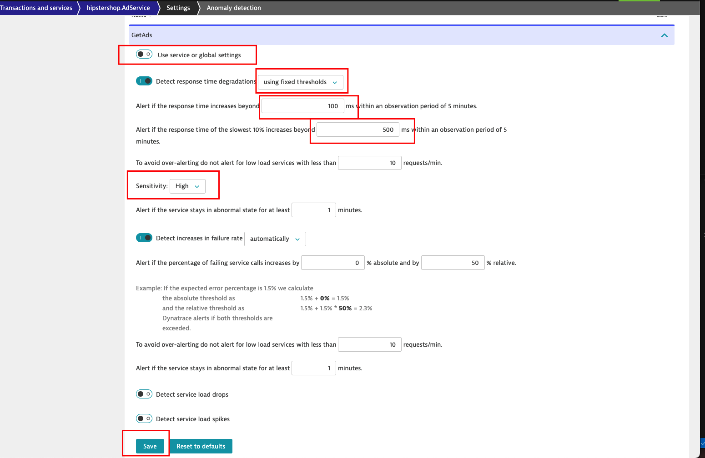

## Configure monitoring

In the previous step we have successfully deployed our application consisting of multiple microservices. The "pipelines definition" was our `shipyard.yaml` file defining the stages as well as deployment and testing strategies. As you might see, there is actually no pipeline code to write with Keptn!

Now that our application is already deployed, we want to strengthen our deployment process by including automated quality gates based on SRE principles such as Service-Level Indicators (SLI) and Service-Level Objecives (SLO). [Learn more also in this YouTube video](https://www.youtube.com/watch?v=650Gn--XEQE). 
Therefore we need to configure Dynatrace and deploy the Dynatrace integration to Keptn to be able to fetch data from Dynatrace which will be used for the evaluation in the [Keptn quality gates](https://keptn.sh/docs/0.7.x/quality_gates/).

### Configure Dynatrace for our project

1. First, we are going to install (update) the Dynatrace integration for Keptn. This is done with applying the Dynatrace service manifest to our Keptn installation in the MicroK8s cluster.
    ```
    kubectl apply -f https://raw.githubusercontent.com/keptn-contrib/dynatrace-service/0.10.3/deploy/service.yaml -n keptn
    ```

1. Verify that we have the dynatrace-service-xxx-xxx pod up and running in the keptn namespace. There should be two new pods running for a few seconds. 
    ```
    kubectl get pods --selector=run=dynatrace-service -n keptn 
    ```


1. Next, we are going to configure our Dynatrace tenant with Keptn. Please note that during the setup of this workshop we have already defined the Dynatrace credentials that are reused in this step.
    ```
    keptn configure monitoring dynatrace --project=hipstershop
    ```

    This will create tagging rules, default dashboards, management zones, alerting profiles and an integration for Dynatrace problem notifications to be sent to Keptn. 

     

1. Let's take a look at the dashboard and what has already been created for us. Please navigate to your Dynatrace tenant, click on Dashboards and the "Hipstershop@Keptn" dashbaord. You will see that we have dedicated dashboards for our two stages "hardening" and "production". 

1. Click on the "Services:production" tile that brings you to all services discovered and running in production. We are going to configure our `AdService` already for some later usage now. Please find the **hipstershop.AdService** in the list of discovered services.

    If you **can not** find the service, please restart the pod with the following command `kubectl delete pod -l=app=adservice-primary -n hipstershop-production`

    It will show up a couple of minutes later.


1. Once you've found the AdService we will mark the primary call of the AdService as a "Key Request" in Dynatrace. Key Requests ins Dynatrace take priority of other requests. For example a login service may have multiple internal and external requests; single failed request to an external database is likely to have a higher business priority than other requests. Making a service call a Key Request allows enables sending instant feed back to teams who want to test how a new deployment or even specific features of a new deployment performs, which we'll be testing in a moment. 

1. From the AdService Screen scroll to the bottom and click on "View Requests":

 

1. This will show us all the requests being made of the service. We then want to use filtering to highlight only the request(s) of high importance. In this case we want to make the GetAds call as a key request of the AdService. Create a key request for the AdService:

- Click on the filter bar 
- Type and select Request:
- Then choose the "GetAds" request 
- Then click on the edit "..." button
- Choose "Mark as Key Request

 

1. Once we have our hipstershop.AdService GetAds request, let's create tweak its Anomaly Detection settings to trigger an alert if this call violates a business driven SLO.

    

- click on the "..." in the header of the service
- click on  "Edit"

    

1. From here select:

- "Anomaly Detection" on the left
- Scroll to the bottom and under "Set thresholds on key requests" 
- click on "Edit" for the "GetAds Service
- Toggle off "Use service or global settings", it is set to **ON** in the below example




1. Modify the service settings as outlined below

- Disable global anomaly detection
- Set "detect response time degradations" to "using fixed thresholds" from the drop down
- Set "Alert if the response time increases beyond 100ms within an observation period of 5 minutes.
- Set "Alert if the response time of the slowest 10% increases beyond" to 500ms
- Set sensitivity to "High"
- See image below for reference




Let's continue with configuring our Keptn to be able to fetch data from Dynatrace.

1. Now we are going to add the Dynatrace SLI service that will fetch the data later on for our quality gates. Please note that currently this is an implementation detail that we are going to install two different services for Dynatrace. 
    ```
    kubectl apply -f https://raw.githubusercontent.com/keptn-contrib/dynatrace-sli-service/release-0.7.1/deploy/service.yaml -n keptn
    ```

1. Finally, to let Keptn know how which data can be fetched and how to do it, we are going to add the SLI configuration file to Keptn. 
    ```
    keptn add-resource --project=hipstershop --resource=/home/$(whoami)/keptn-hotday-2021/keptn-resources/sli-config-dynatrace.yaml --resourceUri=dynatrace/sli.yaml
    ```

    The file looks like this:
    ```
    ---
    spec_version: '1.0'
    indicators:
      throughput: "builtin:service.requestCount.total:merge(0):sum?scope=tag(keptn_project:$PROJECT),tag(keptn_stage:$STAGE),tag(keptn_service:$SERVICE),tag(keptn_deployment:$DEPLOYMENT)"
      error_rate: "builtin:service.errors.total.count:merge(0):avg?scope=tag(keptn_project:$PROJECT),tag(keptn_stage:$STAGE),tag(keptn_service:$SERVICE),tag(keptn_deployment:$DEPLOYMENT)"
      response_time_p50: "builtin:service.response.time:merge(0):percentile(50)?scope=tag(keptn_project:$PROJECT),tag(keptn_stage:$STAGE),tag(keptn_service:$SERVICE),tag(keptn_deployment:$DEPLOYMENT)"
      response_time_p90: "builtin:service.response.time:merge(0):percentile(90)?scope=tag(keptn_project:$PROJECT),tag(keptn_stage:$STAGE),tag(keptn_service:$SERVICE),tag(keptn_deployment:$DEPLOYMENT)"
      response_time_p95: "builtin:service.response.time:merge(0):percentile(95)?scope=tag(keptn_project:$PROJECT),tag(keptn_stage:$STAGE),tag(keptn_service:$SERVICE),tag(keptn_deployment:$DEPLOYMENT)"
    ```

    Please note that we added the file on the project level, which means that all microservices that we added for our project "HipsterShop" can make use of this file. If we want to extend it with to support more SLIs, we would have to add the SLI name and Dynatrace query to this file and add it again to Keptn via the `keptn add-resource` command. But for our workshop, we are all set! 

    Let's continue and build our first quality gate in the next step.
